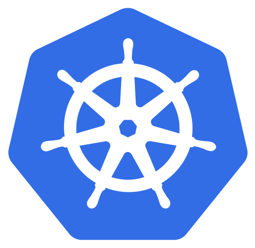

<a name="readme-top"></a>

<p align="center">
  
</p>

<h2 align="center">K8s Storage Providers Evaluation Guide</h2>

<!-- TABLE OF CONTENTS -->
<details>
  <summary>Table of Contents</summary>
  <ul>
    <li><a href="#overview">Overview</a></li>
    <li><a href="#cluster-preparation">Cluster Preparation</a></li>
    <li><a href="#rook-and-ceph">Rook and Ceph</a></li>
    <li><a href="#longhorn">Longhorn</a></li>
    <li><a href="#openebs">OpenEBS</a></li>
    <li><a href="#references">References</a></li>
  </ul>
</details>

## Overview

<a name="overview"></a>

[Container Storage Interface (CSI)](https://github.com/container-storage-interface/spec/blob/master/spec.md) is a standard interface for interaction between container orchestrators and storage providers. Review the following [list of CSI drivers](https://kubernetes-csi.github.io/docs/drivers.html) for different storage solutions.

When it comes to choosing a storage provider, you can go one of two routes:

- Use your cloud provider's storage solution (suitable for cloud-managed clusters)
- Use a cloud-agnostic storage provider (suitable for on-premise and self-managed clusters)

This repo provides a starting point for evaluating different storage providers for Kubernetes.

<p align="right">(<a href="#readme-top">back to top</a>)</p>

## Cluster Preparation

<a name="cluster-preparation"></a>

We will be using [Lima](https://lima-vm.io) for provisioning the Kubernetes cluster that we use for testing. The provisioned VMs will have the following specs:

| Node             | vCPU | Memory | Primary Disk | Additional Disk     | Notes              |
| ---------------- | ---- | ------ | ------------ | ------------------- | ------------------ |
| k8s-controlplane | 4    | 6 GiB  | 20 GiB       | `/dev/vdb` (10 GiB) | Control plane node |
| k8s-worker-1     | 4    | 6 GiB  | 20 GiB       | `/dev/vdb` (10 GiB) | Worker node        |
| k8s-worker-2     | 4    | 6 GiB  | 20 GiB       | `/dev/vdb` (10 GiB) | Worker node        |

Create and configure cluster:

```sh
# NOTE: clone repo
git clone https://github.com/0xzer0x/k8s-storage-providers.git storage-providers
cd storage-providers/infra

# NOTE: create additional disks
for dsk in controlplane worker-1 worker-2; do limactl disk create "${dsk}" --size=10GiB; done

# NOTE: start VMs (edit workers to add their respective disks)
# YAML:
# additionalDisks:
#   - name: worker-N
#     format: false
limactl start --name=k8s-controlplane ./k8s-controlplane.lima.yaml
limactl start --name=k8s-worker-1 ./k8s-worker.lima.yaml
limactl start --name=k8s-worker-2 ./k8s-worker.lima.yaml

# NOTE: join each worker node
for worker in k8s-worker-{1..2}; do
  limactl shell "${worker}" sudo sh -c "$(limactl shell k8s-controlplane sudo kubeadm token create --print-join-command | sed 's/127\.0\.0\.1/lima-k8s-controlplane.internal/g')"
done
```

We will be using the following [`fio`](https://fio.readthedocs.io/en/latest/fio_doc.html#fio-flexible-i-o-tester-rev-version) pod and command for measuring performance of each provider:

```yaml
# WARN: replace placeholders
apiVersion: v1
kind: Pod
metadata:
  name: fio
spec:
  containers:
    - name: fio
      image: nixery.dev/shell/fio
      command:
        - sleep
        - infinity
      volumeMounts:
        - name: <provider>-vol
          mountPath: /<provider>-volume
  volumes:
    - name: <provider>-vol
      persistentVolumeClaim:
        claimName: <provider>-pvc
```

Command:

```sh
PROVIDER="testprovider"
MOUNTPATH="/${PROVIDER}-volume"
fio --name=benchtest --size=800m --filename="${MOUNTPATH}/test" --direct=1 --rw=randrw --ioengine=libaio --bs=4k --iodepth=16 --numjobs=8 --time_based --runtime=60
```

Important metrics include:

- **IOPS**: Number of read/write operations per second.
- **Read bandwidth**: Total amount of data read per second.
- **Write bandwidth**: Total amount of data written per second.
- **Completion latency (`clat`)**: Time taken by kernel and storage stack to complete the I/O.

<p align="right">(<a href="#readme-top">back to top</a>)</p>

## Rook and Ceph

<a name="rook-and-ceph"></a>


> **Reliable Autonomic Distributed Object Store (RADOS)**
>
> The core storage layer of Ceph. It is a self-healing, self-managing, intelligent distributed store designed to provide reliable, scalable storage.

Ceph uses RADOS as it's underlying storage technology, RADOS stores data as objects rather than blocks or files. Each RADOS object consists of:

- Unique name
- Some number of attributes
- Variable-sized data payload

RADOS objects are stored in object pools. Each pool has a unique name and represents a distinct object namespace.

A storage cluster consists of some number of storage servers (object storage daemons, OSDs), and the combined cluster can store any number of storage pools.

A Ceph cluster consists of multiple types of daemons:

- **Monitor (MON)**: Maintain the master copy of the cluster map, which they provide to Ceph clients.
- **Obejct Storage Daemon (OSD)**: Checks its own state and the state of other OSDs and report back to monitors. Responsible for data storage and replication.
- **Manager**: Endpoint for monitoring, orchestration, and plug-in modules.
- **Metadata Server (MDS)**: Manage file metadata when CephFS is used to provide file services.

A cluster map consists of five different maps:

- **Monitor Map**: Contains list of monitor nodes and their addresses.
- **OSD Map**: A list of storage pools, replica sizes, a list of PG numbers and a list of OSDs.
- **PG Map**: The details of each placement group.
- **CRUSH Map**: List of storage devices, failure domain hierarchy, rules for traversing the hierarchy when storing data.
- **MDS Map**: Contains the pool for storing metadata, a list of metadata servers and their statuses.

A Ceph client needs to contact a Ceph monitor to get a copy of the cluster map, which it then uses to determine where to read/write data.

[Rook](https://rook.io/docs/rook/latest-release/Getting-Started/intro/) provides easy integration of Ceph into Kubernetes to provide different types of storage through CSI drivers.

In order to use Rook in your cluster, you require at least one of the following:

- Raw devices (no partitions or formatted filesystem)
- Raw partitions (no formatted filesystem)
- LVM logical volumes (no formatted filesystem)
- Encrypted devices (no formatted filesystem)
- Multipath devices (no formatted filesystem)
- PersistentVolume available from a storage class in `block` mode

## Demo

1. Install Rook operator into `rook-ceph` namespace:

```sh
helm repo add rook-release https://charts.rook.io/release
helm repo update
helm install --create-namespace --namespace rook-ceph rook-ceph rook-release/rook-ceph
# NOTE: wait for operator to be running
kubectl -n rook-ceph get pods -w
```

2. Create a single-node Ceph cluster (using Rook test configuration):

```sh
kubectl apply -f storage-providers/rook-ceph/cephcluster.k8s.yml
# NOTE: wait for cluster CRs and CSI drivers to be running (or use k9s)
watch kubectl get all -n rook-ceph
```

3. Create a CephBlockPool for RBD (RWO) and CephFS shared filesystem (RWX):

```sh
# NOTE: RBD
kubectl apply -f storage-providers/rook-ceph/cephbp.k8s.yml
# NOTE: CephFS
kubectl apply -f storage-providers/rook-ceph/cephfs.k8s.yml
# NOTE: wait for filesystem resource to be running
kubectl get -n rook-ceph pods -w
```

5. Create StorageClass for automatically provisioning volumes:

```sh
kubectl apply -f storage-providers/rook-ceph/storageclass-rbd.k8s.yml
kubectl apply -f storage-providers/rook-ceph/storageclass-cephfs.k8s.yml
```

6. Create a PVC for utilizing the created storage classes:

```sh
kubectl apply -f storage-providers/rook-ceph/pvc-rbd.k8s.yml
kubectl apply -f storage-providers/rook-ceph/pvc-cephfs.k8s.yml
```

9. Access the web UI through port-forwarding:

```sh
kubectl -n rook-ceph port-forward svc/rook-ceph-mgr-dashboard 7000:7000 &>/dev/null &
# NOTE: Login credentials for dashboard are:
# username: admin
# password: <output of command below>
kubectl -n rook-ceph get secret rook-ceph-dashboard-password -o jsonpath='{.data.password}' | base64 -d
```

10. Install troubleshooting toolbox for Ceph (optional):

```sh
kubectl apply -f storage-providers/rook-ceph/toolbox.k8s.yml
```

<p align="right">(<a href="#readme-top">back to top</a>)</p>

## Longhorn

<a name="longhorn"></a>


Longhorn is an open-source, cloud-native solution for storage. It consists of the following components:

- **Longhorn manager**: Running on all nodes as a `DaemonSet`, it is responsible for creating and managing volumes in the cluster and handling API calls from UI or CSI driver.
- **Longhorn engines**: A lightweight service responsible for replica management for a single volume. It runs on the node that the volume is attached to.

Longhorn volumes consist of differencing disks (snapshots) that store only the changes that occurred since the last snapshot.

Longhorn supports storing backups **natively through NFS or S3-compatible storage**. In addition, it supports disaster recovery (DR) volumes for quick fallback to a standby secondary cluster in case of failures in the primary cluster volume.

### Demo

1. Install Longhorn using Helm:

```sh
helm repo add longhorn https://charts.longhorn.io
helm repo update
# NOTE: to view default values
# helm show values longhorn/longhorn | bat --language=yaml
helm install longhorn longhorn/longhorn --namespace longhorn-system --create-namespace
# NOTE: enable v2-data-engine setting (set to true)
kubectl -n longhorn-system edit settings v2-data-engine
# NOTE: add the raw block device attached to each VM
# YAML:
# vdb-block-device:
#   diskType: block
#   path: /dev/vdb
#   allowScheduling: true
#   evictionRequested: false
#   storageReserved: 0
#   tags: []
for node in lima-k8s-controlplane lima-k8s-worker-1 lima-k8s-worker-2; do
  kubectl -n longhorn-system edit node.longhorn.io "${node}"
done
```

2. Create a custom storage class for using data engine v2:

```sh
kubectl apply -f storage-providers/longhorn/storageclass-v2.k8s.yml
```

3. Create a PVC for each data engine:

```sh
kubectl apply -f storage-providers/longhorn/pvc-v1.k8s.yml
kubectl apply -f storage-providers/longhorn/pvc-v2.k8s.yml
```

4. Open the Longhorn UI using port forwarding:

```sh
kubectl port-forward -n longhorn-system svc/longhorn-frontend 8080 &>/dev/null &
```

<p align="right">(<a href="#readme-top">back to top</a>)</p>

## OpenEBS

<a name="openebs"></a>


[OpenEBS](https://openebs.io/docs) is a Kubernetes-native storage solution that provides dynamic local and distributed block storage for containers. It is a CNCF sandbox project that allows Kubernetes users to provision Persistent Volumes (PVs) using Container Attached Storage (CAS) principles.

OpenEBS follows a **modular architecture**, offering multiple storage engines optimized for different use cases:

- **Local PV**: Binds PVs directly to local storage devices or host paths for stateful workloads.
- **Mayastor**: High-performance engine based on SPDK and NVMe-oF.

OpenEBS core components are:

- **OpenEBS Control Plane**: A set of Kubernetes custom controllers and CRDs that manage the lifecycle of storage volumes.
- **Storage Engines**: Each engine runs its own set of pods for controller, replica(s), and volume management.
- **CSI Driver**: Each engine has its own CSI provisioner for dynamic volume provisioning.

### Demo

> [!WARNING]
> The minimum required number of nodes for replicated Mayastor to work is 3[^1].

1. Install OpenEBS mayastor engine using Helm:

```sh
# WARN: required for provisioning engine on nodes
for node in lima-k8s-controlplane lima-k8s-worker-1 lima-k8s-worker-2; do
  kubectl label node "${node}" openebs.io/engine=mayastor
done
# NOTE: add helm repo and install mayastor replicated engine only
helm repo add openebs https://openebs.github.io/openebs
helm repo update
helm install openebs --namespace openebs openebs/openebs --create-namespace --set loki.enabled=false,alloy.enabled=false,engines.local.zfs.enabled=false,engines.local.lvm.enabled=false,engines.replicated.mayastor.enabled=true
# NOTE: wait until all pods are running
kubectl get pods -n openebs
```

2. Create DiskPool objects for attached block devices:

```sh
# NOTE: validate block device link (should be pointing to /dev/vdb)
for machine in k8s-controlplane k8s-worker-1 k8s-worker-2; do
  limactl shell "${machine}" ls -lah /dev/disk/by-path
done
# NOTE: create disk pool for each node containing attached disk (cannot use /dev/vdb)
kubectl apply -f storage-providers/openebs/diskpool.k8s.yml
```

3. Create 3-replica storage class:

```sh
kubectl apply -f storage-providers/openebs/storageclass.k8s.yml
```

4. Create PVC:

```sh
kubectl apply -f storage-providers/openebs/pvc.k8s.yml
```

<p align="right">(<a href="#readme-top">back to top</a>)</p>

## References

<a name="references"></a>

_Architecture and concepts_. Longhorn Documentation. (n.d.). <https://longhorn.io/docs/1.9.0/concepts/>

_Architecture_. Ceph Documentation. (n.d.). <https://docs.ceph.com/en/latest/architecture/>

Kvapil, A. (2022, June 3). _Comparing Ceph, LINSTOR, Mayastor, and vitastor storage performance in kubernetes_. Palark Blog. <https://blog.palark.com/kubernetes-storage-performance-linstor-ceph-mayastor-vitastor/>

Lempa, C. (2024, November 12). _Storage and Backup in Kubernetes! // Longhorn Tutorial_. YouTube. <https://www.youtube.com/watch?v=-ImtLXcEna8>

Nucleuss. (2025, June 13). _Kubernetes Storage Comparison: Ceph, Longhorn, OpenEBS & GlusterFS_. Kubedo Cloud. <https://kubedo.com/kubernetes-storage-comparison/>

Team, E. (2022, February 10). _NVMe Over Fabrics (NVMe-oF) Explained_. Western Digital Corporate Blog. <https://blog.westerndigital.com/nvme-of-explained/>

Weil, S. (2019, July 8). _2019-JUN-27 :: Ceph Tech Talk - Intro to Ceph_. YouTube. <https://www.youtube.com/watch?v=PmLPbrf-x9g>

Wiggins, C. (2024, December 26). _OpenEBS Mayastor vs Longhorn_. Cwiggs. <https://cwiggs.com/posts/2024-12-26-openebs-vs-longhorn/>

[^1]: https://openebs.io/docs/quickstart-guide/prerequisites#minimum-worker-node-count

<p align="right">(<a href="#readme-top">back to top</a>)</p>
